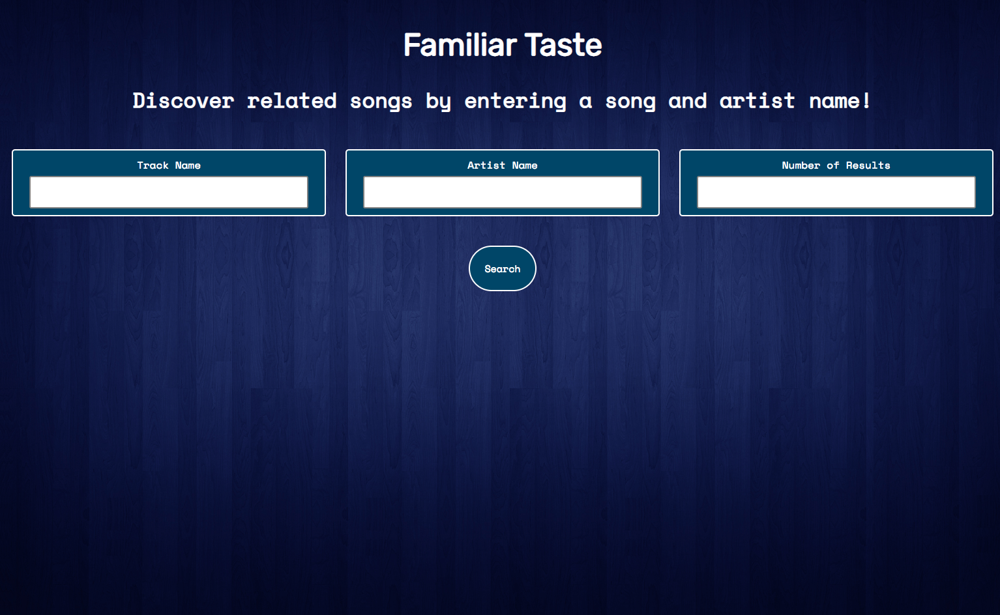
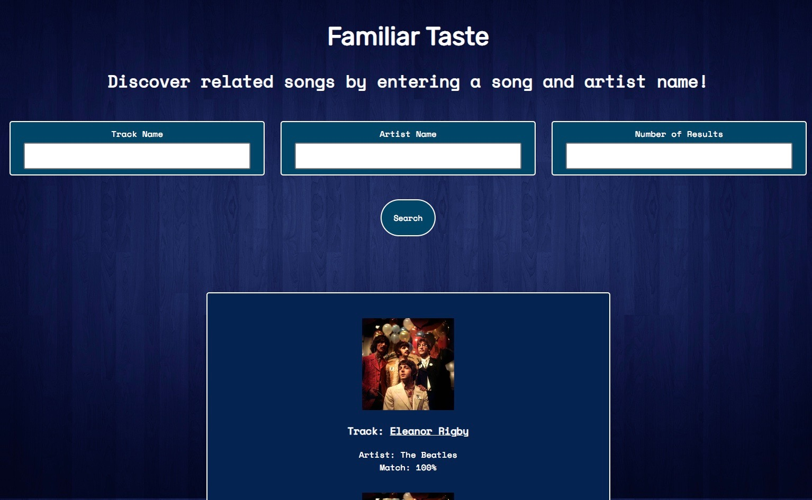
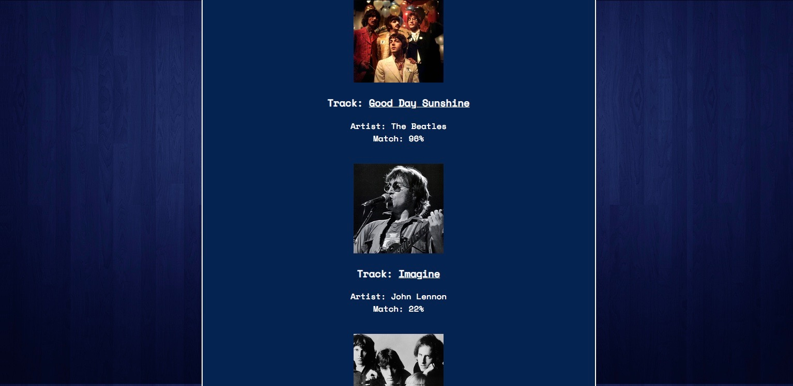
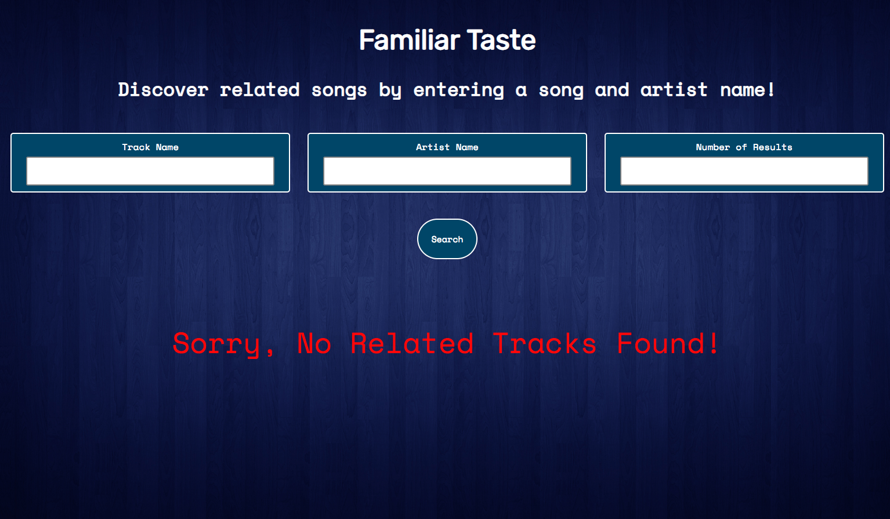

# Familiar Taste

[Live Site](https://davepatel95.github.io/familiar-taste-api-capstone/)

## Screenshots

#### Start Screen

#### Results Screen

#### Error

## Summary
  User inputs the name of a song, the artist and number of results desired and will receive back a list of track names with    the artist, album art, and match percentage (0-100%). This app will allow the user to discover music closely related to particular songs that he/she enjoys!

## Technologies Used
  * HTML
  * CSS
  * JavaScript
  * jQuery
  * Last.fm API
